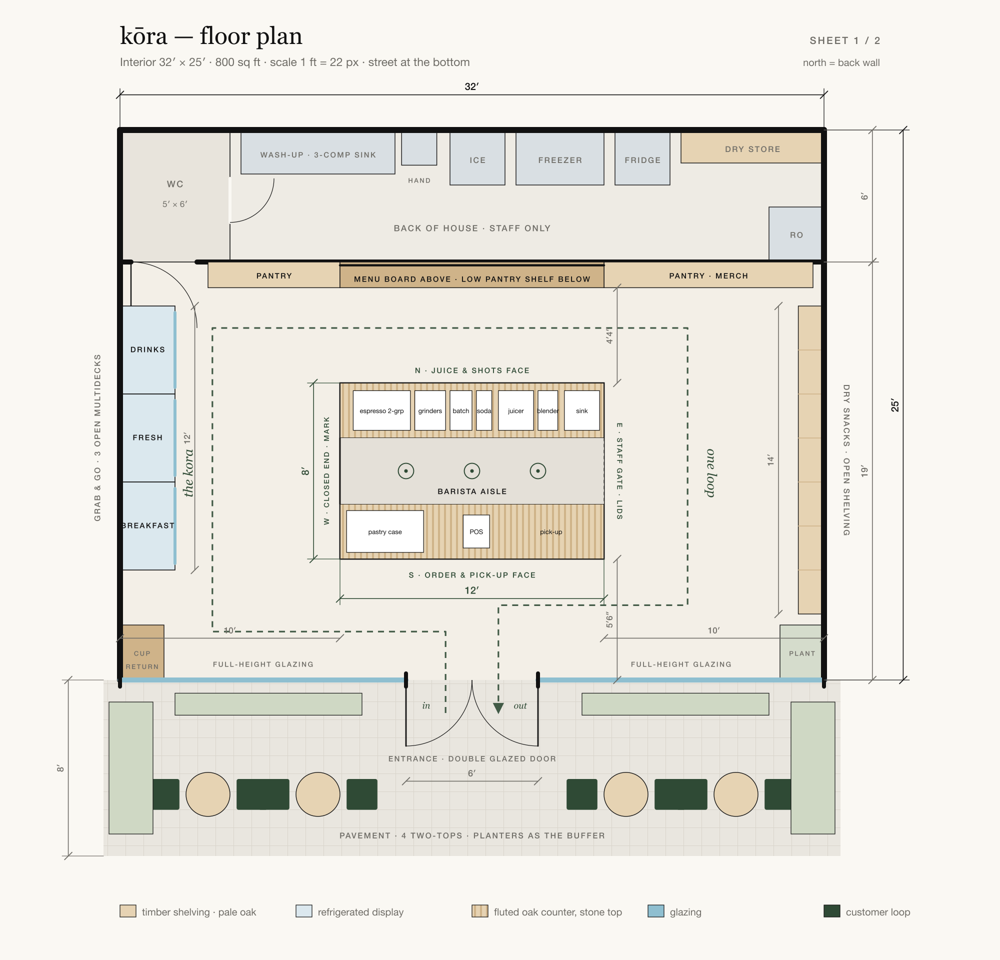
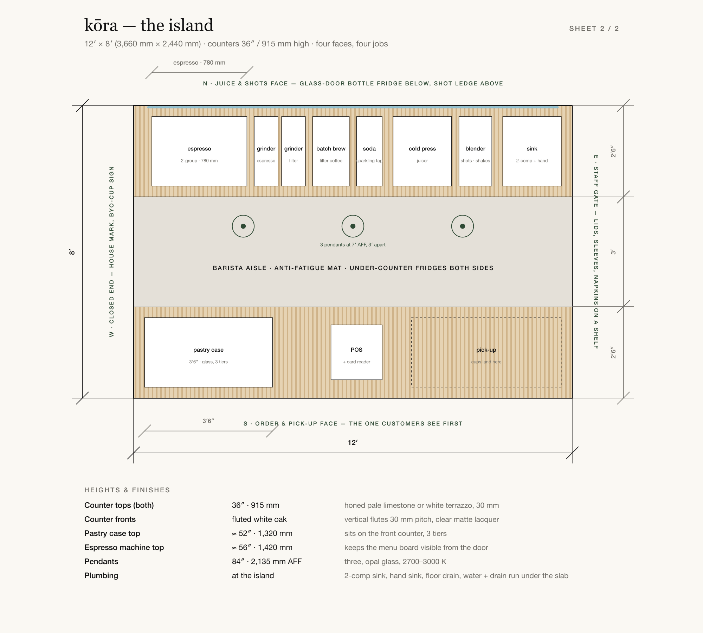

# kōra — the space

The brief for the fit-out: how the café should look and feel, how big it
needs to be, a dimensioned plan, and prompts to render every side of it.
Read this first; `render-prompts.md` and the drawings hang off it.

```
README.md           this brief
floor-plan.svg/png  sheet 1 — the room, 32 × 25 ft, dimensioned
island.svg/png      sheet 2 — the island, 12 × 8 ft, four faces, equipment
build.py            regenerates both drawings; every number lives in PLAN
render-prompts.md   ten paste-ready prompts, one per wall and island face
massing.py          builds massing.svg/png, a labelled 3D block model from PLAN
render.py           renders them with Gemini (or OpenAI); writes renders/
renders/            the images, plus a .json sidecar with the exact prompt used;
                    superseded/ keeps earlier takes
```

Reference board: <https://www.pinterest.com/tashilhatso/k%C5%8Dra-cafe/>
(13 pins, read below). Inspiration plan: the isometric grab-and-go café
image in the chat of 14 Sep 2026 — central island, snacks left, chillers
right, menu on the back wall, tables on the pavement. This plan mirrors the
side walls (chillers left, snacks right) after Tashi's note of 15 Sep 2026:
the drinks and sandwiches are what most people come for, so they come first.

## How it should look and feel

- **A grocer, not a lounge.** The product is the decor. Colour comes from
  bottles of juice, fruit cups and kraft bags in tidy rows; the building
  stays neutral. Nothing on the walls that isn't for sale or for reading.
- **A loop, not a queue.** Kora means circumambulation. The plan is one: in
  the door, down the chillers, across the pantry, back up the snack wall, pay
  at the island, out. Every side of the island does a job so the walk works.
- **Three materials and one colour.** Pale white oak, matte black steel,
  pale stone. Off-white lime plaster walls. Deep forest green only on the
  fascia, the outdoor chairs and small signs. No walnut, no brick, no burlap.
- **Lit shelves, not lit ceilings.** An LED strip under every shelf and
  inside every chiller; three pendants over the island; daylight through the
  glass front. The room reads warm from the street.
- **Signs say what, not how.** Black capitals on white backlit panels —
  GRAB & GO, DRY SNACKS — and small black labels on the shelves. The `ō` mark
  appears twice: on the fascia and on the closed end of the island.
- **Open to the street.** Full-height glazing, doors that stand open, four
  small tables on the pavement with planters as the buffer. Inside, no seats
  beyond a ledge: people are here for two minutes, then on their way.
- **Cold looks cold.** Open-front chillers with the day's bottles faced
  forward are the hero wall. The juice fridge under the island's north face
  glows the same way.
- **Washable.** Porcelain floor, stone tops, sealed timber, Delhi dust wiped
  in one pass. Nothing porous at hand height.

## What the board says

Thirteen pins, four groups.

| Group | Pins | Take |
|---|---|---|
| Street front | orange steel bench and stools against full-height glazing with a white espresso machine visible inside; a white-tiled Paris café with a blue awning, brass-framed windows and white folding chairs on the pavement | One colour outdoors, glass front, the machine visible from the street. Ours is green, not orange or blue |
| Grab & go | GRAB & GO lightbox over timber-framed open multidecks; GRAB & GO in black letters on white slats above a CHEF PREPARED MEALS case; fruit cups and bottled juices with small black price tags; a stainless chiller of parfaits, cold-pressed bottles and salad boxes; a pale-oak grocer wall with backlit drink insets | The left wall, almost exactly. Oak surround, white lightbox, black caps, product faced forward |
| Shelving walls | stained-timber floor-to-ceiling pantry with white brick and canvas totes; LED-lit timber shelves of kraft and clear packets; thin steel shelves on grey plaster with paper-capped jars and baskets; a pale-oak lit wall unit of kraft-box foods with sheer-curtain daylight; PROVISIONS lightbox over plywood shelving on exposed brick | The right and back walls. Take the lit shelves, the kraft packaging, the small labels. Leave the brick, the wicker, the dark stain |
| Island | a live-edge timber display table with fruit baskets in front of an oak chiller wall | The idea of a table in the middle you walk around. Ours is a bar, not a table, and the wood is straight-grained, not live-edge |

Where the board disagrees with itself — rustic (brick, burlap, wicker, dark
stain) versus refined (pale oak, plaster, backlit) — go refined. It matches
the paper-and-green brand and the "clean, unfussy" line in the studio
skill, and it photographs cleaner for the drinks.

## Size

| | Target | Range |
|---|---|---|
| Carpet area | 800 sq ft | 600–1,000 sq ft |
| Frontage | 32 ft | 26 ft minimum for a walk-around island; below that the counter goes against the back wall |
| Depth | 25 ft | 20 ft minimum (14 ft retail + 6 ft back of house) |
| Clear ceiling | 10 ft | 9 ft minimum; no low mezzanines |
| Pavement | 8 ft deep in front of the glass | 5 ft still fits one row of two-tops |

Where 32 ft comes from: island 12 ft + a 5 ft aisle each side + 2 ft 6 in of
chiller on the left + 1 ft 2 in of shelving on the right = 25 ft 8 in, rounded
up to give the queue room in front of the counter.

The 11 Aug 2026 notes ask for 800–1,200 sq ft; the Kamla Nagar market study
sizes a sit-down café at 1,200 sq ft for 35–45 seats. kōra seats nobody
inside, so 800 is the right target and 600 works. Of the six shortlisted
properties, the 625 sq ft unit (property 6) fits the compact plan; the 500
sq ft unit (property 2) only fits a back-wall counter.

## The plan — sheet 1



Interior 32 × 25 ft (9.75 × 7.62 m), street at the bottom.

| Element | Size | Notes |
|---|---|---|
| Retail room | 32 × 19 ft | 608 sq ft |
| Back of house | 32 × 6 ft strip along the back | WC 5 × 6 ft, 3-compartment wash-up sink 7 ft, hand sink, ice machine, chest freezer, upright fridge, dry-store racking, RO unit. Door at the far left |
| Entrance | 6 ft double glazed door, centred | leaves swing out |
| Glazing | 13 ft each side of the door, full height | slim matte-black frames |
| Left wall — grab & go | 3 × 4 ft open multidecks, 2 ft 6 in deep, 6 ft 6 in high | oak surround, 12 ft × 1 ft lightbox above. DRINKS · FRESH · BREAKFAST. Starts 2 ft from the back wall; cup-return stand in the front corner |
| Back wall — menu | 12 ft × 3 ft board, centred, bottom edge 6 ft 6 in AFF | low 3 ft 6 in pantry shelf below it |
| Back wall — pantry | 6 ft (left) and 9 ft 6 in (right) tall shelving | coffee bags, tea, totes, reusable cups |
| Right wall — dry snacks | 14 ft × 14 in deep × 7 ft 6 in high, 7 shelves | starts 2 ft from the back wall; plant in the front corner |
| Island | 12 × 8 ft, centred, 5 ft 6 in from the glass | see sheet 2 |
| Aisles | front 5 ft 6 in; back 4 ft 4 in; left 7 ft 6 in clear; right 8 ft 10 in clear | |
| Pavement | 32 × 8 ft | four two-tops (Ø 24 in), eight chairs, low planters along the glass, tall planters at the ends |

## The island — sheet 2



12 × 8 ft (3,660 × 2,440 mm). Two 2 ft 6 in counters with a 3 ft barista
aisle between them. Tops 36 in / 915 mm, honed pale limestone or white
terrazzo, 30 mm. Fronts vertical fluted white oak, 30 mm pitch.

| Face | Job | On it |
|---|---|---|
| South (faces the door) | order and pick-up | glass pastry case 3 ft 6 in, POS and card reader, 4 ft pick-up stretch |
| North (faces the menu) | juice and shots | cold-press juicer, blender, sparkling tap, shot ledge; glass-door bottle fridge below |
| West end | closed | the `ō` mark, BRING YOUR OWN CUP sign, stack of house cups |
| East end | staff gate | hinged flap; slim shelf of lids, sleeves, napkins on the customer side |
| Inside the aisle | | two-group espresso machine (780 mm), two grinders, batch brewer, 2-compartment sink and hand sink, under-counter fridges both sides, ice bin, anti-fatigue mat |

The island needs water, drainage and a floor drain under the slab. Ask
about it on every site visit; it is the one thing a landlord can't fix
after the floor is laid.

## For property agents

What we are looking for, in the order it matters:

1. Ground floor with street frontage of 26 ft or more, glazed or glazable.
2. 600–1,000 sq ft carpet, one level, 9 ft or more clear height. No low
   upper decks.
3. Water connection and working drainage, or permission to run them to the
   middle of the floor.
4. A washroom, or space and permission to build one.
5. Sanctioned electrical load of 15–20 kW, three-phase: espresso machine,
   ice machine, three chillers, AC, juicer, blender, RO.
6. A pavement or setback in front for four small tables.
7. Commercial zoning and signage rights on the fascia.
8. Within a short walk of gyms, yoga studios, colleges or offices; Kamla
   Nagar's Bungalow Road–Jawahar Nagar junction is the current reference.

Send them `floor-plan.png` and the overview render (prompt 1) with this list.

## Rendering the views

```bash
python3 space/render.py            # all ten, overview first
python3 space/render.py 3 5        # just two views
```

Needs `GEMINI_API_KEY` in the environment (it is in `~/.zshrc`; the
`OPENAI_API_KEY` there is expired, add `--backend openai` once it is
replaced). Default model `gemini-3-pro-image` at 2K, about 35 seconds and
a few rupees a view.

The geometry reference is `massing.png`, a labelled 3D block model that
`massing.py` builds from the same `PLAN` numbers as the floor plan. A 2D plan
alone was not enough: the first overview merged the island into one counter
and put a counter under the menu board. Every view attaches the massing and
the plan; views 2–10 also attach the finished view 1 for materials and
light. If the plan changes: `build.py`, then `massing.py`, then render view 1,
then the rest. Every render gets a `.json` next to it with the
prompt, model and references, so a result can be reproduced or argued with.
Files are JPEG (Gemini returns JPEG) at 2528 × 1696 or 1696 × 2528.

## Regenerating the drawings

```bash
python3 space/build.py
```

Needs `rsvg-convert` for the PNGs (`brew install librsvg`); the SVGs need
nothing. Change a dimension in `PLAN` at the top of `build.py` and every
dimension string, table and drawing moves with it.
